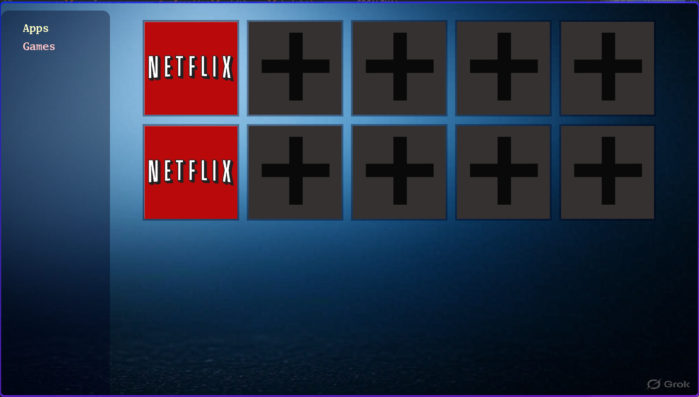

A simple, keyboard-navigable TV app launcher built with Python and Pygame. This project provides a graphical user interface (GUI) for launching applications, with a grid-based menu system, customizable app list, and a form to add new apps.
Features
## Screenshot

    Grid-Based Navigation: Navigate a grid of app buttons using arrow keys (UP, DOWN, LEFT, RIGHT).
    App Launching: Launch applications by selecting a button and pressing ENTER.
    Customizable Background: Set a 1920x1080 background image for a sleek TV-like interface.

Requirements

    Python 3.6+
    Pygame: For rendering the GUI.
    JetBrains Mono Nerd Font: For text rendering (optional, replace with any font).

Install dependencies:
pip install pygame

Installation

    Clone the Repository:
    bash

    git clone https://github.com/MasterTut/launcher.git
    cd launcher

    Set Up the Font:
        The project uses /usr/share/fonts/TTF/JetBrainsMonoNLNerdFontPropo-Regular.ttf.
        If this font isn’t available, update settings.py to use a different font.

        self.font = pygame.font.Font(None, 30)  # Use default system font

    Prepare App Icons:
        The apps.json file references app icons (e.g., ./Assets/addApp.png).
        Ensure the Assets directory exists with the required images, or update apps.json paths.
    Run the Launcher:

    python run.py

Usage

    Navigation:
        Use UP, DOWN, LEFT, RIGHT to move the selection between app buttons.
    Launch an App:
        Select an app button and press ENTER to run its command (defined in apps.json).
    Add a New App:
        Select the "AddApp" button and press ENTER.
        A form appears with fields for Name, Image, and Cmd.
        Navigate fields with UP/DOWN, press ENTER to edit a field, type, and press ENTER again to finish.
        Select "Submit" and press ENTER to save the new app to apps.json.
    Exit:
        Press ESC to exit the launcher or return to the main menu from the add app form.

